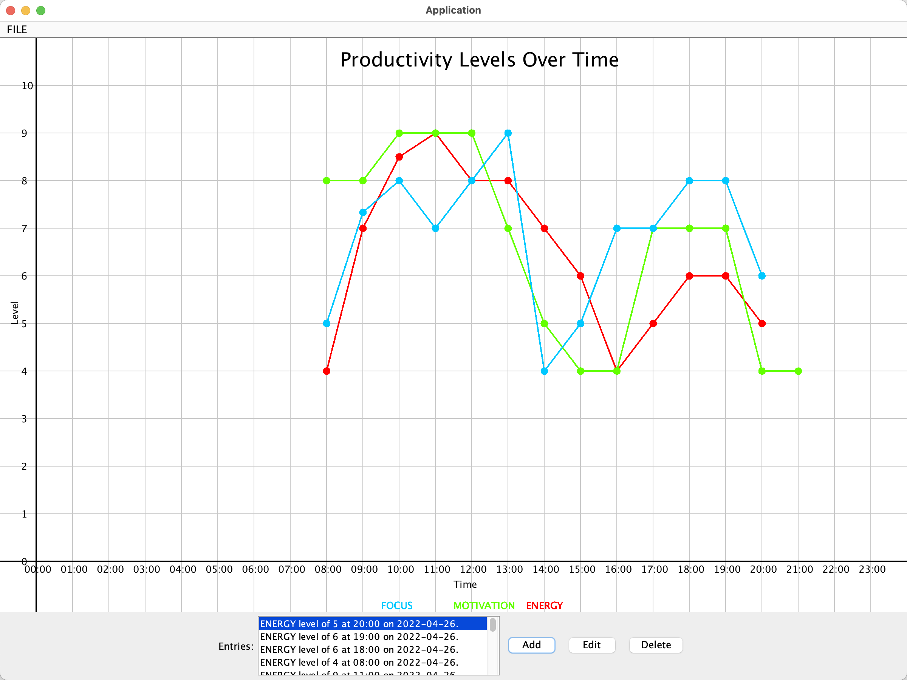

# Productive hours tracker

Console version written in C#, using MySQL for storage at [yangchristina/ProductiveHoursTracker-V2](https://github.com/yangchristina/ProductiveHoursTracker-V2)

## Track your energy, focus, and motivations levels throughout the day

*What will the application do?*

The application will allow the user to log their energy, focus and motivation levels every hour,
and will display their peak energy periods and the time when the user's energy levels are at their lowest. This method 
of logging energy, focus and motivation levels as a way to calculate peak productivity hours was created by Chris 
Bailey, however Chris Bailey used a spreadsheet instead of an application. I hope to make the process of tracking energy
levels easier through creating an application that helps a person do so.

*Who will use it?*

People who want to figure out their 'Biological Prime Time,' as coined by Sam Carpenter, in order to better plan out 
when to do which type of tasks. For example, a person might want to know when their peak productivity periods are
so that they spend this period doing more analytical tasks. Conversely, they may want to put routine tasks, 
such as checking emails into a time when energy levels are the lowest.

*Why is this project of interest to you?*

My interest for this project stemmed from the book *When: The Scientific Secrets of Perfect Timing* by Daniel H. Pink.
In this book, the author talks about the benefits of tracking energy levels to increase one's productivity and efficiency. 
I made this application in order to track my energy levels so that I can use my time more efficiently by plan my day according 
to my productivity levels.

## User Stories
- As a user, I want to be able to log energy, focus and motivation levels out of 10 for a certain time of day
- As a user, I want to be able to quickly log my productivity levels for my current time of day
- As a user, I want to be able to view my past logs, ordered by date of log
- As a user, I want to be able to edit and delete my past productivity entry logs
- As a user, I want to be able to view my peak and trough productivity times
- As a user, I want to be able to visualize patterns in my energy levels through graphs
- As a user, I want to be able to log in and log out of my account 
- As a user, I want to be able to save all my user information, which includes all my productivity logs, to file 
- As a user, I want my user data to be loaded from file when I log in

### Sources for methods of tracking energy levels
- https://alifeofproductivity.com/calculate-biological-prime-time/
- https://www.makeuseof.com/tag/discover-productive-hours-simple-method/

### Example of what is printed in console after the application quits
Fri Apr 01 15:09:18 PDT 2022
Bob added entry: ENERGY level of 5 at 15:00 on 2022-04-01.

Fri Apr 01 15:09:34 PDT 2022
Bob edited entry:
ENERGY level of 5 at 15:00 on 2022-04-01. –––>
FOCUS level of 3 at 22:00 on 2022-04-01.

Fri Apr 01 15:09:36 PDT 2022
Bob removed entry: FOCUS level of 3 at 22:00 on 2022-04-01.

Fri Apr 01 15:10:02 PDT 2022
Sally added entry: MOTIVATION level of 7 at 14:00 on 2022-04-01.

Fri Apr 01 15:10:05 PDT 2022
Sally removed entry: MOTIVATION level of 7 at 14:00 on 2022-04-01.

### Areas to refactor
- Create an association between GraphPanel and DailyAverageLog (give GraphPanel a field of type DailyAverageLog)
  - Currently, the GraphPanel class has a field in DailyAverageLog as its field, which is can be
    quite confusing, so it would make more sense to just access that field in DailyAverageLog directly from a 
  DailyAverageLog object
- Create a GUI class and have LoggedInGUI and LoggedOutGUI extend it to deal with code duplication in these two classes
  - There is some duplication between these classes, such as the such as the save, promptSave, and printLog methods, 
  which can simply be put in the GUI class. LoggedInGUI and LoggedOutGUI having the same superclass would also make
  sense as they are structured quite similarly in the first place (ex. both have a field called frame that is of type
 JFrame which can also be made into a protected field in GUI)
- Replace the Subject class and Observer interface with the Observable and Observer classes from the Java library
  - Did not have time to do this, as I added these classes before we learned about the Observable and Observer classes
  from the Java library
